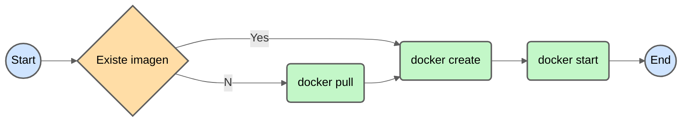

# Docker Basics

Class 1: Docker
Materials: https://www.youtube.com/watch?v=4Dko5W96WHg&t=898s, https://hub.docker.com/, https://dockerlabs.collabnix.com/docker/cheatsheet/
Reviewed: No

# Comandos Iniciales de Docker

## Manejando Imágenes

```docker
docker images 
```

```docker
docker pull <image_name>
```

```docker
docker pull <image_name>:<version>
```

```docker
docker image rm <image_id> <image_id> <image_id> 
```

## Manejando Contenedores

```docker
docker create <image_id>
```

```docker
docker create --name <new_name> <image_id>
```

```docker
docker start <container_id>
```

```docker
docker ps
```

```docker
docker ps -a
```

```docker
docker rm <container_id>
```

### Puertos y Logs

```docker
docker create -p <container_port>:<local_port> <image_id>
```

```docker
docker logs <container_id>
```

```docker
docker logs --follow <container_id>
```

## Docker Run

```docker
docker run <image_name>
```

Es una manera simplificada de descargar la imagen, crear el contenedor y ejecutar el contenedor con la opción `docker logs --follow <container_id>`



```docker
docker run -d <image_name>
```

### Ejemplo

```docker
docker run --name monguito -p 27017:27017 -d mongo
```

## Variables de Entorno

Al crear nuestro contenedor, vamos a necesitar parámetros de configuración definidos por el argumento -e. Estos parámetros varían dependiendo de la imagen descargada y podemos encontrarlo en la documentación de Docker Hub.

### Ejemplo

Para el caso de mongo, es necesario pasar como variables de entorno el username y password bajo la variable de `MONGO_INITDB_ROOT_USERNAME` y `MONGO_INITDB_ROOT_PASSWORD` respectivamente.

```docker
docker create -p 27017:27017 --name monguito -e MONGO_INITDB_ROOT_USERNAME=<db_name> -e MONGO_INITDB_ROOT_PASSWORD=<db_password> mongo:4.4.17
```

# Dockerfile

Es un archivo que se utiliza para que podamos construir imágenes de nuestro **propio proyecto.** 

```docker
# Nos basamos en una imagen previamente creada
FROM <image_name>:<image_tag>

# Indicamos la carpeta donde estará nuestro código fuente dentro del contenedor
# Usualmente se usa /home/app
RUN mkdir -p <container_path>

# Ubicamos los archivos locales y lo copiamos en la carpeta dentro del contenedor
COPY <local_path> <container_path>

# Exponemos un puerto para que otros contenedores o nosotros desde local podamos conectarnos a nuestra app
EXPOSE <container_port>

# Indicamos el comando que tendrá que ejecutar para que nuestra app pueda correr
CMD ["<comand>", "<local_path>"]
# El primer elemento es el comando seguido por sus argumentos especificando la ruta completa
```

### Ejemplo

```jsx
import express from "express";
import mongoose from "mongoose";

const Animal = mongoose.model(
  "Animal",
  new mongoose.Schema({
    tipo: String,
    estado: String,
  })
);

const app = express();

const DB_name = "alex";
const DB_password = "1234";
const Container_name = "monguito"
mongoose.connect(
  `mongodb://${DB_name}:${DB_password}@${Container_name}:27017/miapp?authSource=admin`
);

app.get("/", async (_req, res) => {
  console.log("Listando...");
  const animales = await Animal.find();
  return res.send(animales);
});

app.get("/crear", async (_req, res) => {
  console.log("Creando...");
  await Animal.create({ 
		tipo: "Chanchito", 
		estado: "Feliz" 
	});
  return res.send("ok");
});

app.listen(3000, () => console.log("listening..."));
```

```docker
# Nos basamos en una imagen previamente creada
FROM node:16

# Indicamos la carpeta donde estará nuestro código fuente dentro del contenedor
RUN mkdir -p /home/app

# Ubicamos los archivos locales y lo copiamos en la carpeta dentro del contenedor
COPY . /home/app

# Exponemos un puerto para que otros contenedores o nosotros desde local podamos conectarnos a nuestra app
EXPOSE 3000

# Indicamos el comando que tendrá que ejecutar para que nuestra app pueda correr
CMD ["node", "/home/app/index.js"]
# El primer elemento es el comando seguido por sus argumentos especificando la ruta completa
```

## Manejando Networks

Los contenedores pueden tener conexión hacia afuera gracias al Port Mapping, pero estos no necesariamente podrán comunicarse entre sí. Para que estos puedan interconectarse es necesario agruparlos en redes o networks. 

```docker
docker network ls
```

```docker
docker network create <network_name>
```

```docker
docker network rm <network_name>
```

Al conectar a la base de datos, `localhost` se cambia por el nombre de nuestro contenedor.

```jsx
mongoose.connect(
  `mongodb://test:1234@${Container_name}:27017/miapp?authSource=admin`
);
```

### Haciendo la build

```docker
docker build -t <my_image_name>:<my_image_tag> <local_path>
```

Usando el comando `docker images` podemos ver nuestra imagen creada

### Asignando una Network a un Container

```docker
docker create -p <container_port>:<local_port> --name <new_name> --network <network_name> -e MONGO_INITDB_ROOT_USERNAME=<db_name> -e MONGO_INITDB_ROOT_PASSWORD=<db_password> mongo:4.4.17
```

Luego de crear nuestros contenedores bajo el mismo network, podemos ejecutarlos con `docker start <container_name>` 

<aside>
❗ Para verificar que los contenedores están siendo usados podemos ver sus respectivos logs gracias al comando `docker logs <container_name>`

</aside>

# Y LISTO! 🥳🎉

Ahora, para automatizar todo esto, podemos usar [Docker Compose](https://www.notion.so/Docker-Compose-b83f2d6a0471427d86315a188b1522fe)